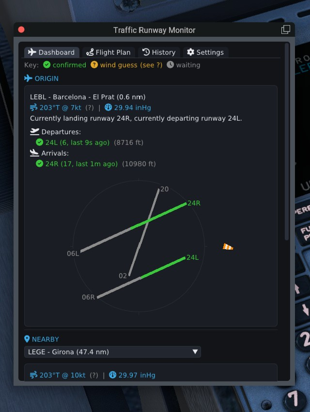
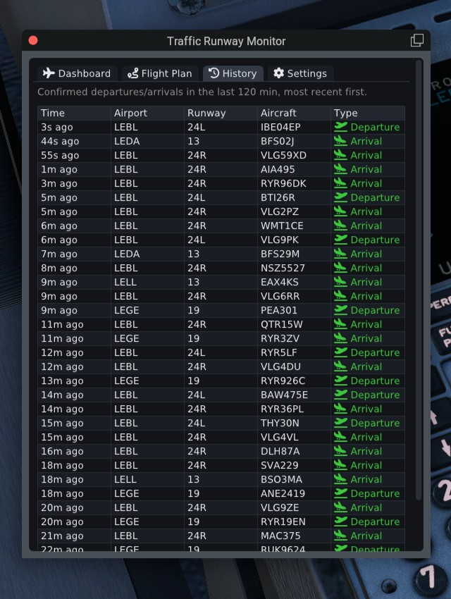
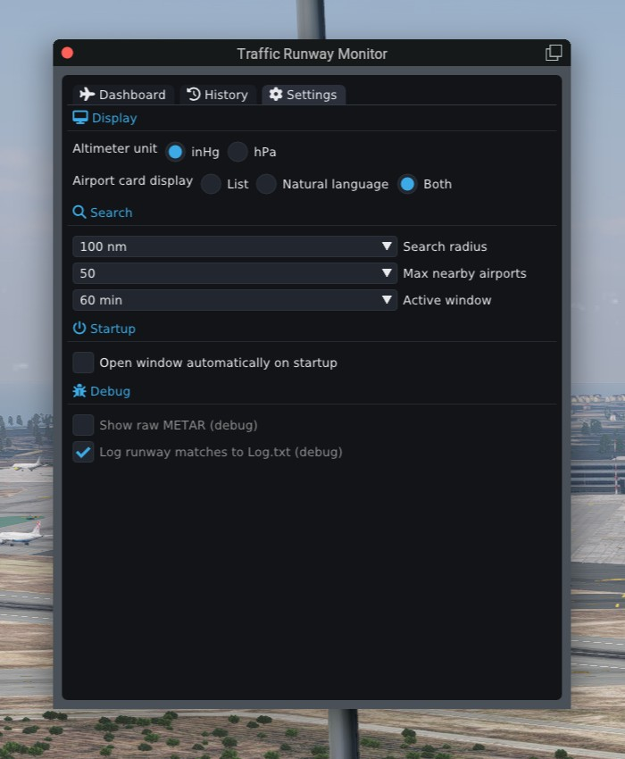

# TrafficRunwayMonitor

An X-Plane 12 plugin that watches nearby AI/multiplayer traffic and reports
confirmed runway arrivals and departures in an ImGui dashboard.

## Why

You plan an approach the way you normally would: check the winds, read the
METAR, pick the runway that makes sense for the conditions. Then, on short
final, you realize the actual active runway for landings at that airport is
the opposite one, because that's what the synthetic traffic (AI aircraft, or
other pilots in multiplayer) is actually using. Sorting that out mid-approach
is annoying at best, and, especially in VR where you can't just glance at a
2D map to sanity-check things, it breaks immersion at exactly the moment you
should be focused on flying.

This plugin keeps an eye on that traffic for you: it confirms, from actual
observed flight paths, which runways nearby aircraft are really using, so you
can see that information on a dashboard ahead of time instead of discovering
it as a surprise out the window.

## What it does

Every ~1 second, the plugin pulls nearby traffic, matches each aircraft
against the runway geometry of the closest airport (heading, cross-track and
along-track distance to the runway centerline), classifies its flight phase
(approach, departure, on the ground, or taxiing), and tracks each aircraft's
recent history to confirm a genuine arrival or departure, filtering out
one-off geometry flukes and overflights. Confirmed events show up in the
in-game window with aircraft identity (callsign, ICAO type when available),
runway, and category.

Two traffic sources feed the same pipeline, and the plugin prefers whichever
is available:
- **LiveTraffic's bulk API** (via LTAPI): callsign + ICAO aircraft-class
  info, no cap on the number of tracked aircraft.
- **TCAS Override / legacy multiplayer**: a fallback with no aircraft
  identity or type data, capped at 63 aircraft.

It also picks up your own flight plan's origin and destination, so those
airports stay pinned and get checked even if they fall outside the normal
search radius. It reads these straight from X-Plane's own native FMS flight
plan entries; for aircraft or situations where that isn't populated, the
Flight Plan tab lets you type them in manually, or fetch them in one click
from your current Simbrief flight plan (pilot ID configured once in
Settings).

## Using it

Open the plugin's window from X-Plane's Plugins menu. It has four tabs:
- **Dashboard**: currently-tracked traffic and their live phase/runway match.
- **Flight Plan**: origin/destination ICAO, editable whenever the native FMS
  has no matching entry; a "Fetch from Simbrief" button fills them in from
  your current Simbrief OFP (pilot ID configured once in Settings) and shows
  its planned route in LIDO-style text (e.g.
  `LEBL/20 SENIA2J SENIA Z596 NEXAS N975 ADUXO ADUXO3D LEMD/32R`). A
  Procedures block recommends a departure SID and arrival STAR/approach that
  actually match the runway in use, parsed straight from X-Plane's own CIFP
  navdata rather than trusting Simbrief's tentative OFP runway guess, with
  each pick freely overridable and the runway(s) currently active for
  confirmed real traffic highlighted for reference.
- **History**: confirmed arrival/departure events (icao/runway/category/callsign).
- **Settings**: display and search options (altimeter unit, airport card
  layout, search radius), plus debug options including logging runway
  matches to `Log.txt`.

| Dashboard | History | Settings |
|-----------|---------|----------|
|  |  |  |

## How the matching/confirmation logic works

Each cycle, every tracked aircraft is checked against the runway geometry of
nearby airports: heading within ~15° of runway heading, within ~0.5nm
cross-track of the extended centerline, and within ~8nm along-track. A
single matching cycle isn't enough on its own to confirm an event, since
that snapshot has no memory of previous cycles and no real terrain probe
(altitude above ground is approximated from the matched airport's published
elevation), so a lone geometry match could be a fluke or a momentary mismatch
between two closely-spaced airports. Instead, an aircraft has to keep
matching the same runway consistently across several consecutive cycles
before it's confirmed as a genuine arrival or departure and logged to the
History tab. This hysteresis is what keeps brief flickers from producing
false positives while still catching real, sustained runway usage.

## Building

Requires CMake and a C++17 toolchain. The X-Plane SDK and all other
third-party dependencies (ImGui, ImgWindow, LTAPI) are vendored under
`third_party/`; Catch2 (for the test suite) is fetched automatically by CMake.

```sh
cmake -S . -B build -DCMAKE_BUILD_TYPE=RelWithDebInfo
cmake --build build --config RelWithDebInfo --target TrafficRunwayMonitor
```

### Running the tests

`src/core/` is a pure-logic library with no X-Plane SDK dependency, fully
covered by a Catch2 unit test suite:

```sh
cmake --build build --config RelWithDebInfo --target trm_core_tests
ctest --test-dir build --output-on-failure
```

## Output

The build produces `TrafficRunwayMonitor.xpl` under a per-platform folder:

| Platform | Output path                          |
|----------|---------------------------------------|
| Windows  | `build/win_x64/TrafficRunwayMonitor.xpl` |
| macOS    | `build/mac_x64/TrafficRunwayMonitor.xpl` |
| Linux    | `build/lin_x64/TrafficRunwayMonitor.xpl` |

To install, copy the relevant platform folder into
`<X-Plane 12 install>/Resources/plugins/TrafficRunwayMonitor/<platform>/`.

## License

MIT — see [LICENSE](LICENSE).
